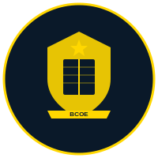

# 🏆 BCOE Sports Event Registration System

A premium, responsive web application for managing sports event registrations at **Bharat College of Engineering**, organized by the Student Council.



## 🎯 Overview

This application provides a modern, user-friendly interface for students to register for various indoor and outdoor sports events. Built with vanilla JavaScript, HTML5, and CSS3, it features a professional navy blue, white, and gold color scheme with smooth animations and comprehensive form validation.

## ✨ Features

### 🎨 Premium Design

- Navy blue (#0A1929), white, and gold (#FFD700) color palette
- Glassmorphism effects and smooth animations
- Mobile-first responsive design
- Google Fonts (Inter) for modern typography

### 🏅 Sports Categories

**Boys Sports:**

- **Outdoor**: Open Cricket (11), Box Cricket (6), Kabaddi (7), Running (1), Football (11), Volleyball (6)
- **Indoor**: Carrom (2), Chess (1)

**Girls Sports:**

- **Outdoor**: Box Cricket (6), Kabaddi (7), Kho-Kho (9)

### 📝 Dynamic Registration Forms

- Auto-generated based on sport requirements
- Team name and player inputs
- Captain/Vice-Captain selection (for team games)
- Contact number, department, and year fields
- Real-time form validation

### ✅ Comprehensive Validation

- Required field checking
- Duplicate player name detection
- Captain ≠ Vice-Captain enforcement
- 10-digit contact number format
- User-friendly error messages

### 💾 Data Persistence

- LocalStorage integration
- Automatic save on submission
- Persistent across browser sessions
- Real-time registration counter

## 🚀 Getting Started

### Prerequisites

- Modern web browser (Chrome, Firefox, Safari, Edge)
- No installation or dependencies required!

### Running the Application

1. **Clone or download** the project files

2. **Open in browser**:

   ```bash
   # Navigate to project directory
   cd bcoe_sports

   # Open index.html in your default browser
   open index.html
   ```

   Or simply double-click `index.html` to open in your browser.

3. **Start registering**!
   - Select Boys or Girls sports
   - Filter by Indoor/Outdoor
   - Click any sport card to register

## 📁 Project Structure

```
bcoe_sports/
├── index.html              # Main application page
├── README.md               # This file
├── css/
│   └── styles.css          # Complete design system
├── js/
│   ├── sportsData.js       # Sports configurations
│   ├── storage.js          # LocalStorage management
│   ├── formHandler.js      # Form generation & validation
│   └── app.js              # Main application controller
└── assets/
    └── logo.svg            # College logo
```

## 💻 Technology Stack

- **HTML5**: Semantic markup structure
- **CSS3**: Custom properties, flexbox, grid, animations
- **JavaScript (ES6+)**: Modular vanilla JavaScript
- **Google Fonts**: Inter font family
- **LocalStorage API**: Client-side data persistence

## 🎓 Usage Guide

### For Students

1. **Select Gender Tab**: Click on "Boys Sports" or "Girls Sports"
2. **Filter Games**: Use "All Games", "Outdoor", or "Indoor" filters
3. **Choose Sport**: Click on any sport card
4. **Fill Form**:
   - Enter team/participant name
   - Fill in all player names
   - Select captain and vice-captain (for team games)
   - Provide contact number
   - Select department and year
5. **Submit**: Click "Submit Registration"
6. **Confirmation**: Success message will appear

### For Administrators

Access registration data via browser Developer Tools:

```javascript
// Get all registrations
const registrations = JSON.parse(
  localStorage.getItem("bcoe_sports_registrations"),
);

// Get statistics
const stats = getRegistrationStats();
console.log(stats);
```

## 🔒 Data Storage

All registration data is stored in the browser's LocalStorage with the key `bcoe_sports_registrations`. Data format:

```javascript
{
  "id": "reg_1234567890_abc123",
  "sportId": "boys-football",
  "sportName": "Football",
  "teamName": "Champions FC",
  "players": ["Player 1", "Player 2", ...],
  "captain": "Player 1",
  "viceCaptain": "Player 2",
  "contact": "9876543210",
  "timestamp": "2026-02-02T15:30:00.000Z"
}
```

## ☁️ Google Sheets Integration

**NEW!** The application now supports automatic cloud backup to Google Sheets via Google Apps Script.

### Benefits

✅ **Centralized Data**: All registrations in one Google Sheet  
✅ **Real-time Sync**: Instant updates to the cloud  
✅ **Zero Cost**: No server or database expenses  
✅ **Easy Export**: Download as Excel, CSV, or PDF  
✅ **Dual Storage**: LocalStorage backup for offline capability

### Quick Setup

1. Create a new Google Sheet
2. Open **Extensions → Apps Script**
3. Paste the code from `google-apps-script/Code.gs`
4. Deploy as **Web App** with "Anyone" access
5. Copy the Web App URL
6. Update `webAppUrl` in `js/googleSheetsIntegration.js`

**📖 Full setup guide**: See [`GOOGLE_SHEETS_SETUP.md`](file:///Users/yashpal/Documents/Project/bcoe_sports/GOOGLE_SHEETS_SETUP.md)

### What Gets Saved

Every form submission is automatically sent to Google Sheets with:

- Auto-generated timestamp
- All form fields (team name, players, contact, etc.)
- Sport metadata (name, gender, category)
- Formatted in clean, exportable columns

**📊 Technical details**: See [`GOOGLE_SHEETS_INTEGRATION.md`](file:///Users/yashpal/Documents/Project/bcoe_sports/GOOGLE_SHEETS_INTEGRATION.md)

## 📱 Responsive Design

The application is fully responsive and tested on:

- **Desktop** (1920px+): Full layout with grid columns
- **Tablet** (768-1024px): Adapted grid layout
- **Mobile** (320-767px): Single column, stacked navigation

## ✅ Validation Rules

1. **All fields required**: Cannot submit with empty fields
2. **Unique player names**: No duplicate names allowed
3. **Different captain/vice-captain**: Must select different players
4. **Contact format**: Must be exactly 10 digits
5. **Player count**: Automatically enforced per sport

## 🎨 Color Palette

```css
--color-navy: #0a1929 /* Primary brand */ --color-white: #ffffff
  /* Backgrounds */ --color-gold: #ffd700 /* Accents */;
```

## 🌐 Browser Support

- ✅ Chrome (latest)
- ✅ Firefox (latest)
- ✅ Safari (latest)
- ✅ Edge (latest)

## 📝 License

This project is created for **Bharat College of Engineering** Student Council. For educational and institutional use.

## 👥 Credits

**Developed for**: Student Council - Bharat College of Engineering  
**Purpose**: Sports Event Registration System  
**Year**: 2026

## 🆘 Support

For issues or questions, contact the Student Council office at Bharat College of Engineering.

---

**Made with ❤️ for BCOE Students**

🎯 **Start registering for sports events today!**
